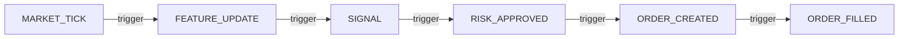

# QTRADER EVENT-DRIVEN PIPELINE

> **Version:** 1.0  
> **Type:** Deterministic Event Flow  
> **Protocol:** KILO.AI Zero-Latency Architectural Standard

---

## 1. CORE EVENT TYPES

| Event Type | Source | Layer | Description |
|------------|--------|-------|-------------|
| `MARKET_TICK` | `Data Feed` | L1 | New price/volume update from exchange. |
| `FEATURE_UPDATE` | `Feature Engine` | L2 | Vectorized indicators recalculated. |
| `SIGNAL` | `Strategy Engine` | L3 | Entry/Exit decision with probability. |
| `RISK_APPROVED` | `Risk Engine` | L4 | Pass all limit checks (Fat-finger, Drawdown, etc). |
| `ORDER_CREATED` | `Execution Engine` | L5 | New order instance generated. |
| `ORDER_FILLED` | `OMS / Broker` | L6 | Full/Partial execution receipt. |

---

## 2. DETERMINISTIC FLOW RULES

The pipeline follows a strict **linear DAG**. Any violation (skipping or reverse) is a CRITICAL LINT ERROR and must trigger a `SystemHalt`.



### Flow Enforcement Matrix

| From \ To | FEAT | SIG | RISK | ORD | FILL |
|-----------|------|-----|------|-----|------|
| **TICK** | ✅ | ❌ | ❌ | ❌ | ❌ |
| **FEAT** | ❌ | ✅ | ❌ | ❌ | ❌ |
| **SIG** | ❌ | ❌ | ✅ | ❌ | ❌ |
| **RISK** | ❌ | ❌ | ❌ | ✅ | ❌ |
| **ORD** | ❌ | ❌ | ❌ | ❌ | ✅ |

---

## 3. USAGE CONTRACT

### `EventFlowEngine` (Conceptual Interface)

Every event dispatch in the `EventBus` MUST be validated against this engine.

```python
class EventFlowEngine:
    """
    Ensures zero-loop and deterministic event propagation.
    Used by: Global Orchestrator / EventBus
    """
    
    TRANSITIONS = {
        "MARKET_TICK": ["FEATURE_UPDATE"],
        "FEATURE_UPDATE": ["SIGNAL"],
        "SIGNAL": ["RISK_APPROVED"],
        "RISK_APPROVED": ["ORDER_CREATED"],
        "ORDER_CREATED": ["ORDER_FILLED"]
    }

    def next_events(self, event_type: str) -> list[str]:
        """
        Returns the only valid next step in the pipeline.
        Throws error if event_type is unknown or terminal.
        """
        return self.TRANSITIONS.get(event_type, [])

    def validate_transition(self, from_event: str, to_event: str) -> bool:
        """
        Hard enforcement: returns True ONLY if the transition is defined.
        """
        return to_event in self.next_events(from_event)
```

---

## 4. VALIDATION & SAFETY

### 4.1 Invalid: Skipping Steps
- `MARKET_TICK` → `SIGNAL` (Invalid)  
  *Reason: Signals MUST be derived from calculated features to prevent look-ahead bias.*

### 4.2 Invalid: Reverse Flow
- `ORDER_CREATED` → `RISK_APPROVED` (Invalid)  
  *Reason: Risk checks MUST occur before order creation to prevent fat-finger latency.*

### 4.3 Error Handling
- **Unknown Event:** Triggers `UnknownEventException` + immediate `TradingHalt`.
- **Out-of-Order Event:** Triggers `PipelineSequenceViolation` + `Panic`.

---

## 5. TEST SPECIFICATIONS

### Unit Tests
- `test_valid_flow`: Verify `TICK` -> `FEAT` returns `True`.
- `test_invalid_skip`: Verify `TICK` -> `SIG` is rejected.
- `test_invalid_reverse`: Verify `ORD` -> `RISK` is rejected.

### Integration Simulation
- Simulate `10,000` events and verify that the `EventFlowEngine` state machine remains consistent.
- Benchmarking: Verification overhead MUST be `< 5µs`.

---

_Documented by Antigravity — Senior Quant Engineer_
