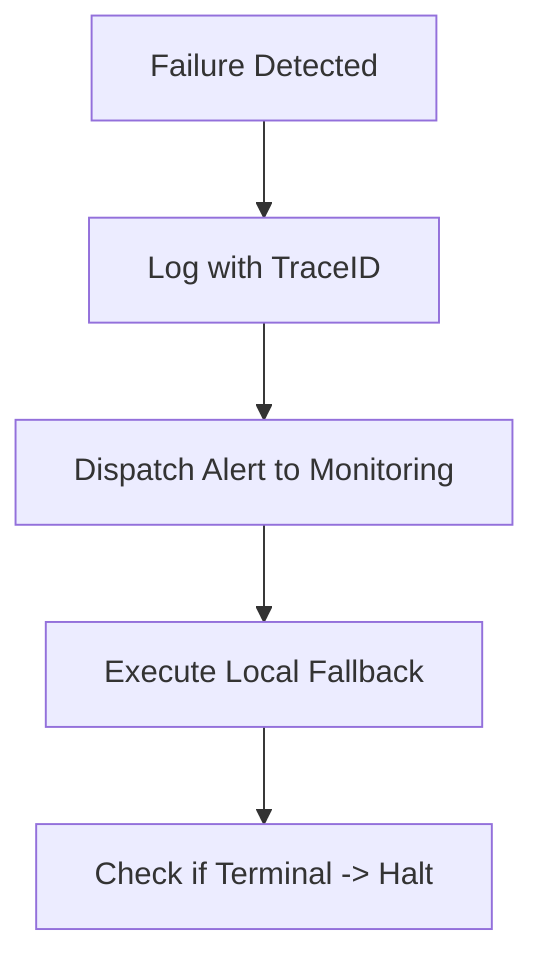

# QTRADER FAILURE MODES & SYSTEM RESILIENCE

> **Version:** 1.0  
> **Type:** High-Availability Fault Tolerance  
> **Protocol:** KILO.AI Resilience Standard - Zero Silent Failure

---

## 1. CORE PRINCIPLE: NO SILENT FAILURE

Every exception or anomalous state MUST be explicitly handled. Unhandled failures should default to the most restrictive safety state (`SystemHalt`).

---

## 2. FAILURE TYPES & CLASSIFICATION

| Type | Severity | Description | Action |
| --- | --- | --- | --- |
| `data_gap` | **Medium** | Missing sequence IDs or stalled market feed. | **Log → Alert → Fallback** |
| `exchange_down` | **High** | WebSocket disconnect or API time-out. | **Log → Alert → Fallback → Halt** |
| `recon_mismatch` | **CRITICAL** | OMS position != Exchange position. | **Log → Alert → IMMEDIATE HALT** |
| `latency_spike` | **Low** | Pipeline stage > limit (see `latency_budget`). | **Log → Alert → Degrade** |

---

## 3. HANDLING FLOW (EVENT-DRIVEN)

The standard response to any failure follows the **Resilience Chain**:



1. **Log**: Record full stack trace and state via `loguru`.
2. **Alert**: Broadcast `EventType.ERROR` to the `EventBus`.
3. **Fallback**: Attempt to recover gracefully (e.g., reconnect, switch venue).
4. **Halt**: If recovery is not possible or the failure is critical (`RECON_MISMATCH`), terminate all trading processes.

---

## 4. USAGE CONTRACT: `FailureHandler`

### Interface Specification

The `FailureHandler` is the centralized entry point for all error management.

```python
class FailureHandler:
    """
    Standardized entry for error propagation and system safety.
    Used by: Every module in QTrader (L1-L7)
    """

    CRITICAL_MODES = ["RECON_MISMATCH", "SECURITY_BREACH"]

    def handle(self, error_type: str, context: dict = None) -> bool:
        """
        Public method to process a failure.
        - Triggers logging/alerts.
        - Returns True if recovered, False if it leads to SystemHalt.
        """
        self._log(error_type, context)
        self._alert(error_type)
        
        if error_type in self.CRITICAL_MODES:
            # Immediate, non-blocking call to Kill Switch
            self._trigger_system_halt(error_type)
            return False
            
        return self._execute_fallback(error_type)

    def _trigger_system_halt(self, reason: str):
        # Publish SystemHalt event -> Force-close brokers -> Exit
        pass
```

---

## 5. SPECIFIC FAILURE SCENARIOS

### 5.1 Reconciliation Mismatch (CRITICAL)

- **Condition**: `PositionManager.reconcile()` returns `MISMATCH`.
- **Response**: `handle("recon_mismatch")` -> Immediate `TradingHalt`. No new orders allowed until manual operator intervention.

### 5.2 Exchange WebSocket Down (HIGH)

- **Condition**: Heartbeat lost for 1,000ms.
- **Response**: `handle("exchange_down")` -> Attempt reconnect 3 times. If failed -> Cancel all open orders and notify the War Room.

---

## 6. TEST SPECIFICATION

### Unit: Handling Logic

- `test_critical_halt`: Verify `handle("recon_mismatch")` triggers the `SystemHalt` event.
- `test_fallback_success`: Verify `handle("data_gap")` attempts to switch to a secondary data source.

### Integration: Failure Injection

- Use a `ChaosMonkey` script to simulate random disconnects and mismatched position states during a live simulation. Verify that 100% of failures follow the specified Handling Flow.

### Failure Condition

- **SYSTEM HALT:** If the `FailureHandler` encounters an unknown `error_type`, it MUST default to the most safe state: `Immediate Trading Halt`.

---

#### Documented by Antigravity — Senior Quant Engineer
