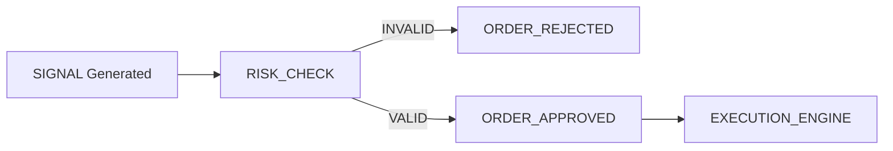

# QTRADER RISK GATING SYSTEM

> **Version:** 1.0  
> **Type:** Real-time Risk Enforcement  
> **Protocol:** KILO.AI Risk First Protocol - No Order Bypasses Risk

---

## 1. CORE PRINCIPLE: RISK FIRST

Trading signals are non-binding recommendations. Every order MUST pass through the `RiskGateEngine` before reaching any execution venue. Any order that bypasses the risk check is an architectural violation and must trigger an immediate `SystemHalt`.

---

## 2. RISK FLOW PIPELINE

The risk gating system operates as a mandatory checkpoint between strategy logic and order execution.



---

## 3. RISK ENFORCEMENT RULES

The `RiskGateEngine` evaluates each order against three primary limiters:

| Rule | Description | Action on Violation |
| --- | --- | --- |
| **VaR Limit** | Value-at-Risk for the entire portfolio does not exceed the absolute limit. | **Reject Signal** |
| **Drawdown Limit** | Further execution is halted if strategy/portfolio drawdown > threshold. | **Halt Session** |
| **Position Limit** | Absolute quantity per symbol and net-leverage must remain within bounds. | **Resize / Reject** |

---

## 4. USAGE CONTRACT: `RiskGateEngine`

The `RiskGateEngine` is used exclusively by the `ExecutionEngine` immediately before order dispatch.

### Interface Specification

```python
class RiskGateEngine:
    """
    Mandatory gating system for all order flow.
    Ensures that every order complies with pre-defined risk mandates.
    """

    def evaluate(self, order: OrderEvent) -> RiskDecision:
        """
        Evaluate an order for risk compliance.
        
        Args:
            order: The OrderEvent proposed for execution.
            
        Returns:
            RiskDecision: Object containing 'approved' (bool) and 'reason' (str).
        """
        # 1. Check Symbol-specific position limit
        # 2. Check Portfolio-wide net leverage
        # 3. Check Real-time VaR impact
        # 4. Check Global Drawdown limit
        pass
```

### Trigger Requirement

```python
# execution_engine.py
async def send_order(self, order: OrderEvent):
    decision = self.risk_gate.evaluate(order)
    if not decision.approved:
        logger.warning(f"[RISK_REJECTED] {order.symbol} | Reason: {decision.reason}")
        return
        
    await self.venue.dispatch(order)
```

---

## 5. TEST SPECIFICATION

### Unit: Rule Enforcement

- `test_var_limit_breach`: Ensure orders triggering a VaR breach are rejected.
- `test_max_drawdown_halt`: Ensure any order attempt while in a drawdown halt is rejected.
- `test_position_size_clamping`: Ensure orders exceeding position limits are either rejected or clamped to the max limit.

### Integration: Order Pipeline

- `test_pipeline_bypass`: Attempt to send an order directly to the `venue` without passing `RiskGateEngine`. Verify that the architectural validator (L7) flags this as a critical failure.

### Failure Case

- **Violation:** Any risk rule violation results in an immediate **REJECT** and dispatch of a `RISK_REJECTED` event to the `MonitoringService`.

---

## 6. DEFINITION OF DONE (DoD)

- [x] Every order route passes through the `RiskGateEngine`.
- [x] VaR, Drawdown, and Position limits are enforced.
- [x] Zero silent bypasses.

---

#### Documented by Antigravity — Senior Quant Engineer
