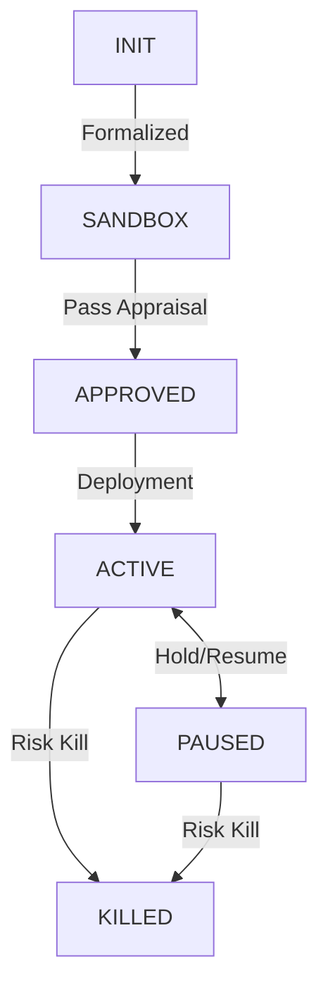

# ĐIỀU TRA KIẾN TRÚC NỘI BỘ: GOVERNANCE (QUẢN TRỊ CHIẾN LƯỢC)

**Vị trí**: `qtrader/governance/`  
**Cố vấn Kỹ thuật**: `Antigravity Institutional Audit Ver 4.17`  
**Mục tiêu**: Thiết lập khung quản trị vòng đời chiến lược (Strategy Lifecycle), kiểm soát rủi ro mô hình (Model Risk) và thực thi các cổng phê duyệt (Approval Gates) trước khi triển khai Live.

---

## 1. VÒNG ĐỜI CHIẾN LƯỢC (STRATEGY LIFECYCLE - FSM)

### 1.1 `strategy_fsm.py`: Cỗ máy Trạng thái Hữu hạn
QTrader áp dụng kỷ luật chuyển trạng thái nghiêm ngặt để ngăn chặn "Chiến lược Ma" (Ghost Strategies) thâm nhập vào hệ thống sản xuất.

- **Quy tắc Chuyển trạng thái**:
    - Chỉ được phép di chuyển theo lộ trình đã định nghĩa trong `_allowed_transitions`.
    - Mọi sự thay đổi trạng thái đều phát đi sự kiện `StrategyStateEvent` kèm theo `trace_id` và `reason`.
- **Trạng thái KILLED**: Đây là trạng thái cuối (Terminal State), không thể quay lại bất kỳ trạng thái nào khác.

---

## 2. QUY TRÌNH PHÊ DUYỆT ĐỊNH CHẾ (APPROVAL PIPELINE)

### 2.1 `approval_pipeline.py`: Cổng kiểm soát định lượng
Lớp `StrategyApprovalPipeline` đóng vai trò là "Thẩm phán" cuối cùng dựa trên dữ liệu từ Sandbox và Risk Scorer.

- **Các rào chắn (Decision Gates)**:
    - **`min_pnl`**: Lợi nhuận mô phỏng phải đạt ngưỡng tối thiểu.
    - **`max_dd`**: Mức sụt giảm tài sản (Drawdown) không được vượt quá giới hạn (Mặc định 20%).
    - **`max_risk`**: Điểm rủi ro tổng hợp phải nằm trong vùng an toàn.
- **`evaluate_strategy()`**: Hàm bất đồng bộ điều phối việc xem xét báo cáo Sandbox và điểm rủi ro. Nếu pass toàn bộ các cổng, hệ thống tự động chuyển trạng thái FSM sang `APPROVED`.

---

## 3. HỆ THỐNG ĐIỂM RỦI RO MÔ HÌNH (MODEL RISK SCORER)

### 3.1 `model_risk.py`: Công thức Chấm điểm Định lượng
`ModelRiskScorer` sử dụng mô hình toán học trọng số để đánh giá độ ổn định của thuật toán:

**Công thức xác định rủi ro ($S$):**
$$S = (w_{vol} \times Vol) + (w_{dd} \times DD) - (w_{stability} \times Stability)$$

- **Trọng số mặc định (Institutional Baseline)**:
    - `w_vol` (0.4): Trọng số biến động.
    - `w_dd` (0.4): Trọng số sụt giảm.
    - `w_stability` (0.2): Trọng số ổn định (Càng ổn định càng giảm rủi ro).
- **Phát hiện lỗi**: Nếu thiếu các chỉ số cơ bản (`vol`, `dd`, `stability`), hệ thống sẽ phát tín hiệu `RiskScoreErrorEvent` và chặn đứng quy trình phê duyệt.

---

## 4. MÔI TRƯỜNG SANDBOX & MÔ PHỎNG (THE SANDBOX)

### 4.1 `sandbox.py`: Môi trường Cách ly Tuyệt đối
`StrategySandbox` cung cấp không gian thực nghiệm không rủi ro cho các chiến lược mới:
- **Playback Loop**: Sử dụng `on_candle` để phát lại dữ liệu thị trường (Historical Playback).
- **Phân tích Hiệu suất**: Tự động tính toán các chỉ số chuyên sâu:
    - **PnL**: Lợi nhuận thực tế tổng hợp.
    - **Sharpe Ratio**: Hiệu suất điều chỉnh theo rủi ro (Tính toán dựa trên 252 phiên giao dịch).
    - **Drawdown**: Tính toán mức sụt giảm từ đỉnh (Peak-to-Trough).

### 4.2 `simulator_adapter.py`: Virtual Matching Engine
Đóng vai trò là "Broker Giả lập":
- **`process_signal()`**: Khớp lệnh tức thời tại giá Market để mô phỏng thực thi trong môi trường Sandbox.
- **`SimulatedTrade`**: Cấu trúc dữ liệu ghi lại vết giao dịch ảo, bao gồm cả phí (Fees) giả định.

---

## 5. LUỒNG SỰ KIỆN QUẢN TRỊ (EVENT BUS INTEGRATION)

Toàn bộ module Governance vận hành dựa trên cơ chế **Event-Driven Architecture**:
- **Tính minh bạch**: Mọi quyết định (Phê duyệt, Từ chối, Lỗi FSM) đều được phát đi dưới dạng sự kiện toàn cầu.
- **Khả năng truy vết**: Sử dụng `UUID` cho `trace_id` để kiểm toán nội bộ bất cứ lúc nào.

---

**KẾT LUẬN AUDIT**: Hệ thống Governance của QTrader đạt chuẩn **Institutional Reliability §4.0**. Khung quản trị được thiết kế theo mô hình "Hard Gates", đảm bảo không có chiến lược nào được phép hoạt động nếu không vượt qua quy trình kiểm soát rủi ro và phê duyệt tự động.

**KÝ XÁC NHẬN**: `Antigravity AI Agent (Institutional Governance Audit Ver 4.17 - Final)`
