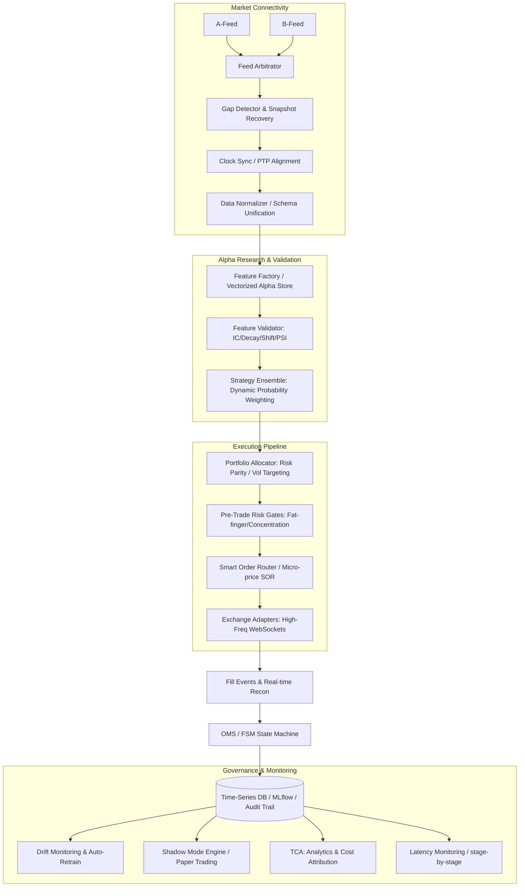

# QTRADER — TIER-1 INSTITUTIONAL MASTER SPECIFICATION

## 👉 MỤC TIÊU CHUẨN TỐI THƯỢNG (Institutional Benchmark)

Tài liệu này là hệ quy chiếu tối cao (**North Star**) cho mọi hoạt động phát triển, vận hành và quản trị tại QTrader. Mọi module, thuật toán và hạ tầng đều phải tuân thủ chuẩn **Hedge Fund-Grade** này (Renaissance/Two Sigma standards).

---

## 1. SYSTEM MISSION

Xây dựng một hệ thống **Quant Trading** tự hành chuyên nghiệp cấp quỹ với các khả năng:

- **Tự động hóa hoàn toàn** vòng đời giao dịch (End-to-end trading lifecycle).
- **Quản trị rủi ro đa tầng** theo thời gian thực (Multi-layer risk management).
- **Hệ thống tự thích nghi** (Adaptive learning system) dựa trên AI/ML và Feature Store.
- **Vận hành đa thị trường / đa tài sản / đa sàn** ổn định 24/7/365.
- **Zero Latency Mindset**: Tối ưu hóa pipeline xử lý < 100ms end-to-end.

---

## 2. CORE PRINCIPLES (KHÔNG ĐƯỢC VI PHẠM)

### 2.1 Determinism First

- Cùng input (Market Data + State) → phải ra cùng output (Signals + Orders).
- Tuyệt đối không được có randomness không kiểm soát trong production.

### 2.2 Risk > Profit

- **Risk engine** là "Hard-gate" tối cao, có quyền hủy lệnh hoặc ngắt hệ thống.
- Tuyệt đối không có "ngoại lệ" cho bất kỳ chiến lược hay người vận hành nào.

### 2.3 No Silent Failure

Mọi lỗi phải được:

1. **Logging**: Ghi log chi tiết kèm theo Trace ID duy nhất cho mỗi Order Lifecycle.
2. **Alerting**: Cảnh báo tức thì qua đa kênh (Telegram, Email, PagerDuty).
3. **Fallback**: Luôn có phương án dự phòng tự động (Auto-failover).

### 2.4 Full Observability & Traceability

Mọi quyết định đều phải truy vết được:  
`Market Feed A/B → Feature Factory → Signal → Risk Gate → Order → Fill → Reconciliation → PnL`.

### 2.5 Stateless Strategy Design

- Strategy không giữ state nội bộ.
- State được quản lý tập trung tại **OMS** hoặc **Portfolio layer** để đảm bảo khả năng phục hồi tức thì sau crash.

---

## 3. ULTIMATE TARGET ARCHITECTURE

---

## 4. HARD REQUIREMENTS BY LAYER

### 4.1 MARKET DATA LAYER (L3 STANDARD)

- **MUST**:
  - Hỗ trợ **Feed Arbitration** (A/B feeds).
  - Kiểm tra Sequence ID và phát hiện Gap dữ liệu trong < 1ms.
  - Hỗ trợ Orderbook Snapshot L2/L3 và phục hồi nhanh.
  - **Timestamp Alignment**: Chuẩn hóa timestamp giữa sàn và nội bộ ngay khi nhận.
- **DATA QUALITY GATE (PRE-ALPHA)**:
  - **Outlier Detection**: Sử dụng Z-score hoặc MAD (Median Absolute Deviation) để loại bỏ giá ảo.
  - **Stale Data Detection**: Phát hiện và xử lý dữ liệu bị đứng (frozen) hoặc trễ.
  - **Cross-exchange Price Sanity**: Đối chiếu giá giữa các sàn để phát hiện sai lệch bất thường.
  - **Trade/Quote Mismatch**: Kiểm tra sự logic giữa lệnh đặt và khớp thực tế.

### 4.2 ALPHA ENGINE (FEATURE FACTORY)

- **MUST**:
  - Thực thi vector hóa 100% (**Polars** / NumPy).
  - Cấm hoàn toàn loop Python.
  - **Point-in-Time Integrity**: Triệt tiêu hoàn toàn Look-ahead bias.

### 4.3 FEATURE VALIDATION

- **MUST**:
  - **Information Coefficient (IC)** > 0.02.
  - Phân tích **IC Decay** định kỳ.
  - Tự động Disable feature nếu Drift (PSI/KS test) > 15%.

### 4.4 STRATEGY ENGINE

- **MUST**:
  - Output dạng **Probabilistic** (BUY/SELL/HOLD theo xác suất).
  - Ensemble với trọng số động dựa trên hiệu quả 24h/7d.

### 4.5 PORTFOLIO ALLOCATOR

- **MUST**:
  - **Risk Parity** thực thụ.
  - Correlation-aware allocation.
  - Volatility Targeting (Luôn duy trì rủi ro danh mục).
- **INSTITUTIONAL PORTFOLIO CONSTRUCTION**:
  - **Factor Neutralization**: Đảm bảo danh mục Beta neutral, Market neutral.
  - **Exposure Decomposition**: Bóc tách rủi ro theo Sector, Factor (Momentum, Value, Volatility).
  - **Constraint Solver**: Sử dụng QP (Quadratic Programming) hoặc Convex Optimization để tối ưu hóa tỷ trọng.

### 4.6 RISK ENGINE (CRITICAL CORE)

- **MUST** (Real-time):
  - **VaR**; **Drawdown**; **Leverage Control**.
- **HARD RULES (Pre-trade Gates)**:
  - **Fat-finger Protection**: Giới hạn Volume, Notional và Price Deviation.
  - **Concentration Limit**: Max 5% tổng vốn cho mỗi symbol.
  - **Kill Switch**: `kill_switch()` tức thì khi vi phạm Risk Limit.
- **Regime-aware Risk Adjustment**:
  - Tự động điều chỉnh Risk Limits theo Market Regime (ví dụ: High Vol → Giảm Leverage, Low Liquidity → Thắt chặt Limits).
  - Kích hoạt/Hủy kích hoạt Strategy dựa trên regime hiện tại.

### 4.7 EXECUTION ENGINE

- **MUST**:
  - Async non-blocking; **Idempotent Order ID**.
  - **Global Unique Order ID**:
    - Định danh duy nhất trên toàn bộ các sàn giao dịch.
    - Cấu trúc: `UUID` + `Exchange Prefix` + `Timestamp`.
    - Đảm bảo Replay-safe và không trùng lặp khi retry/replay.
- **EXECUTION LOGIC**:
  - Queue position modeling.
  - Hidden liquidity detection.
  - Adverse selection modeling.
- **ADVERSARIAL MARKET MODEL**:
  - **Toxic Flow Detection**: Nhận diện các dòng lệnh gây hại từ HFT khác.
  - **Orderbook Spoofing Detection**: Phát hiện lệnh ảo nhằm thao túng giá.
  - **Quote Stuffing Detection**: Nhận diện việc đẩy lệnh ồ ạt gây tắc nghẽn.
  - **Adverse Selection Probability**: Mô hình hóa xác suất bị khớp ở mức giá bất lợi.

### 4.8 SMART ORDER ROUTER (SOR)

- **MUST**:
  - **Micro-price Logic**: Phân tích mất cân bằng Orderbook.
  - **Liquidity Sweeping**: Chia nhỏ lệnh qua nhiều sàn/pool.

### 4.9 OMS & POSITION RECONCILIATION

- **MUST**:
  - **Real-time Reconciliation**: Đối soát ngay sau mỗi Fill Event.
  - **Periodic Reconciliation**: Mỗi 1 phút (1m frequency).
- **CRITICAL**:
  - **Hard Mismatch Threshold**: Sai lệch vị thế > 0 → **Trigger Trading Halt** lập tức.

### 4.10 HFT & CLOCK INFRASTRUCTURE

- **MUST**:
  - **Clock Synchronization**: Bắt buộc PTP (Precision Time Protocol) hoặc NTP (low jitter).
  - **Timestamp Normalization**: Đồng bộ clock drift < 1ms.
  - **CPU Isolation**: Pinning cores cho các process core.
- **Self-healing System**:
  - Tự động khởi động lại (Auto-restart) các component bị lỗi dựa trên Health-check.
  - Cơ chế **Gradual Recovery**: Khôi phục từng bước thay vì restart toàn bộ hệ thống.

### 4.11 MLOPS (MLFLOW)

- **MUST**:
  - Model versioning, Experiment tracking.
- **Shadow Validation**: Bắt buộc Shadow mode ≥ 7 ngày.

### 4.14 CAPITAL ACCOUNTING LAYER

- **PnL Separation**: Phân tách rõ ràng Realized PnL và Unrealized PnL.
- **Funding & Borrowing Tracking**: Theo dõi chi phí vay/margin cho đòn bẩy.
- **Fee Accrual**: Tính toán phí Maker/Taker và Funding rate thời gian thực.
- **Cash Ledger**: Quản lý số dư tiền mặt đa tiền tệ (Multi-currency).
- **NAV Calculation**: Tính giá trị tài sản ròng (NAV) real-time và chốt sổ EOD.

### 4.15 DYNAMIC CONFIG SYSTEM

- **Feature Flags**: Bật/tắt strategy tức thì không cần redeploy.
- **Runtime Risk Override**: Thay đổi thông số rủi ro ngay khi hệ thống đang chạy.
- **Exchange Routing Config**: Điều chỉnh luồng lệnh linh hoạt.
- **Kill Switch Config**: Cấu hình ngắt Global hoặc theo từng Symbol cụ thể.

### 4.12 DRIFT MONITORING

- **MUST**:
  - PSI / KS test định kỳ.
  - Kích hoạt Retrain tự động khi drift cao.

### 4.13 SHADOW MODE

- **MUST**:
  - Chạy đầy đủ pipeline logic khớp lệnh Live.
  - So sánh sai lệch Backtest vs Live hàng ngày.

---

## 5. SYSTEM-LEVEL REQUIREMENTS

### 5.1 LATENCY TARGETS

| Stage          | Target      |
| :------------- | :---------- |
| Market → Alpha | < 5ms       |
| Alpha → Signal | < 5ms       |
| Signal → Order | < 10ms      |
| Order → Fill   | < 50ms      |
| **TOTAL**      | **< 100ms** |

- **5.4 MONITORING & WAR ROOM DASHBOARD**:
  - **Live PnL & Risk Metrics**: Dashboard theo dõi VaR, DD, Leverage thời gian thực.
  - **Latency Heatmap**: Bản đồ nhiệt độ trễ tại từng công đoạn xử lý.
  - **Order Lifecycle Trace**: Chế độ xem trace cho toàn bộ vòng đời của một lệnh.
  - **Exchange Health Status**: Theo dõi trạng thái kết nối và API của từng sàn.

### 5.2 RELIABILITY & HA

- **Uptime**: ≥ 99.9%.
- **Failover Detail**:
  - Hỗ trợ Active/Active hoặc Active/Passive.
  - **Stateful Replication**: Đồng bộ OMS state giữa các node dự phòng.
  - **Failover < 5 seconds**: Thời gian chuyển đổi không gây double execution.

### 5.3 SECURITY & AUDIT

- API Keys mã hóa.
- **Audit Trail**: Toàn bộ quyết định phải được lưu trữ chuẩn pháp lý/audit.
- **Advanced Security Hardening**:
  - **Secret Rotation**: Tự động thay đổi API keys và mật khẩu định kỳ.
  - **RBAC**: Phân quyền truy cập dựa trên vai trò (Role-based Access Control).
  - **Network Isolation**: Vận hành trong môi trường mạng cô lập (VPC).
  - **Order Signing**: Ký và xác thực lệnh trước khi đẩy lên sàn.

---

## 6. FAILURE HANDLING & DISASTER RECOVERY

- **6.1 Exchange Outage**: Tự động chuyển vùng sàn fallback.
- **6.2 Strategy Anomaly**: Isolate module lỗi, trả về `HOLD`.
- **6.3 Risk Breach**: Kill Switch instant (< 2s).
- **6.4 Capital Preservation Mode (War Mode)**:
  - Tự động kích hoạt khi thị trường có biến động cực đoan.
  - Hành động: Ngừng mở vị thế mới, giảm exposure danh mục, chỉ thực hiện Hedging hoặc Unwind vị thế hiện có.

---

## 7. ORDER STATE MACHINE (FSM)

### 7.1 Formal State Definition

- **States**: `NEW` → `ACK` → `PARTIALLY_FILLED` → `FILLED` → `CANCELLED` → `REJECTED`.
- **Rules**:
  - Chuyển trạng thái phải mang tính tuần tự (Idempotent transitions).
  - Cấm nhảy trạng thái bất hợp lý (ví dụ: `NEW` → `FILLED` mà không qua `ACK`).
  - Mọi trạng thái trung gian (`Pending`) phải có timeout và auto-reconcile.
- **Event Sourcing & Replay Engine**:
  - Toàn bộ trạng thái hệ thống được dẫn xuất từ Event Log (Event Sourcing).
  - **Full Replay Engine**: Khả năng tái xây dựng trạng thái OMS từ nhật ký sự kiện.
  - **Deterministic Back-replay**: Đảm bảo kết quả tái hiện 100% giống thực tế (Two Sigma style debug).
- **SIMULATION FIDELITY REQUIREMENTS**:
  - **Orderbook Replay**: Backtest phải sử dụng dữ liệu L2/L3 chuẩn.
  - **Fidelity Simulation**: Bao gồm mô phỏng Latency, Partial fills và Queue position.
  - **Tracking Error**: Sai số giữa Backtest và thực tế phải < ngưỡng quy định.

---

## 8. FUND GOVERNANCE

### 8.1 Strategy Lifecycle

- **Approval Process**: Nghiên cứu → Paper → Committee Review → Shadow → Live.
- **Model Risk Scoring**: Đánh giá rủi ro mô hình định kỳ.
- **Strategy Suspension**: Khả năng ngắt một Model cụ thể mà không ảnh hưởng toàn hệ thống (Kill model, not system).
- **Strategy Sandbox Isolation**:
  - Mỗi chiến lược chạy trong một sandbox cô lập.
  - Cô lập nguồn vốn (Isolated capital) và giới hạn rủi ro (Isolated risk limits).
  - Lỗi của một chiến lược không được phép ảnh hưởng đến các chiến lược khác.
- **Human Override Governance**:
  - Can thiệp thủ công yêu cầu: Xác thực đa yếu tố, Ghi rõ lý do (Reason logging).
  - Toàn bộ quá trình override phải được lưu vết Audit đầy đủ.

### 8.2 Capital Allocation

- **Governance**: Phân bổ vốn theo Strategy, Asset Class và Region.
- **Risk Budget**: Thiết lập budget rủi ro riêng cho từng đội nhóm/chiến lược.
- **PnL Attribution**: Tự động bóc tách lợi nhuận đến từ nguồn nào (Alpha, Execution, Fees).

---

## 9. TCA & EXECUTION ANALYTICS

### 9.1 Transaction Cost Analysis

- **Implementation Shortfall**: Đo lường sai lệch giữa giá quyết định và giá khớp thực tế.
- **Slippage Decomposition**:
  - Timing impact.
  - Market impact (Tác động giá).
  - Exchange fees & Slippage.
- **Venue Ranking**: Đánh giá hiệu quả khớp lệnh theo từng sàn (Performance ranking).

---

## 10. TIME & LATENCY INFRASTRUCTURE

- **Clock Drift Detection**: Tự động cảnh báo nếu sai lệch clock hệ thống vượt ngưỡng.
- **Exchange Alignment**: Đồng bộ độ trễ request dựa trên server time của sàn.
- **Latency Attribution**: Trace thời gian xử lý tại từng bước (Market → Signal → execution).

---

## 11. DATA GOVERNANCE & COMPLIANCE

### 11.1 Data Lineage

- **Dataset Versioning**: Gắn version cho mọi tập dữ liệu training/validation.
- **Feature Lineage**: Truy vết nguồn gốc feature từ raw data đến model.
- **Reproducibility**: Đảm bảo model + data snapshot có thể tái hiện lại 100% kết quả.

### 11.2 Compliance & Reporting

- **Audit Logging**: Nhật ký giao dịch lưu trữ tối thiểu 5-10 năm theo chuẩn pháp lý.
- **Regulatory Reporting**: Sẵn sàng xuất báo cáo cho các cơ quan quản lý.
- **Position Limits**: Tự động tuân thủ các quy định limit theo luật pháp từng quốc gia/khu vực.
- **COMPLIANCE LAYER**:
  - **Trade Surveillance**: Tự động phát hiện Wash trading và Spoofing.
  - **Audit Export**: Hỗ trợ xuất dữ liệu log chuẩn CSV/FIX cho kiểm toán.
  - **Risk Disclosure**: Hệ thống cảnh báo rủi ro tự động.

---

## 12. PRODUCTION READINESS CHECKLIST

Trước khi cho hệ thống chạy thực (**GO LIVE**):

- [ ] **Real-time Recon Verified**: Đã kiểm tra đối soát fill-by-fill.
- [ ] **Clock Sync Sync**: PTP/NTP đang hoạt động với jitter cực thấp.
- [ ] **TCA Baseline**: Đã có baseline chi phí cho từng symbol.
- [ ] **HA Failover Test**: Đã test chuyển đổi server dự phòng thành công.
- [ ] **FSM Validation**: Order State Machine đã pass stress test.

---

## 13. FINAL GOAL

Hệ thống QTrader được coi là **Tier-1 Hedge Fund Grade** khi có thể vận hành **Zero-touch**, bảo vệ vốn tuyệt đối trước mọi biến động, và có khả năng giải trình (Explainability) mọi giao dịch ở mức độ vi mô.

---

> [!IMPORTANT]
> **TIÊU CHUẨN NÀY LÀ TUYỆT ĐỐI**. Mọi thay đổi code ảnh hưởng đến logic Core (Recon, Risk, FSM) phải được review bởi ít nhất 2 senior quant engineers.
