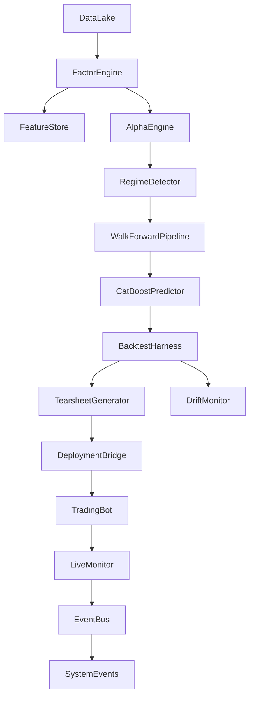

# Unified QTrader Pipeline – Data Flow

This document describes the research → backtest → deploy → monitor flow with the backtest as the validation gate.

## Architecture Diagram

## Pipeline Stages

1. **Research (ResearchPipeline)**  
   DataLake → FactorEngine → AlphaEngine → RegimeDetector → (optional) WalkForward ML → BacktestHarness → DriftMonitor → gate & export.

2. **Backtest (BacktestHarness)**  
   Single entry point: VectorizedEngine + TearsheetGenerator + optional portfolio/risk. Outputs BacktestResult (tearsheet, DataFrame, HTML + JSON sidecar).

3. **Deployment (DeploymentBridge)**  
   Approved ResearchResult → bot config YAML and baseline JSON for LiveMonitor.

4. **Live (TradingBot)**  
   Signal loop: fetch bars → features → alpha → regime → AlphaCombiner → EV/WR gates → OrderEvent. Rebalance loop: returns matrix → HRP weights → VolTargetSizer → rebalance orders.

5. **Monitor (LiveMonitor)**  
   Compare PerformanceTracker vs baseline TearsheetMetrics; drift check; on degradation publish SystemEvent(EMERGENCY_HALT).

## Dependency Rules

- **Backtest** never imports from **bot/**.
- **Bot** loads baseline from JSON (TearsheetMetrics.from_json) and optionally uses **pipeline.monitor** (LiveMonitor).
- **Pipeline** orchestrates core, data, features, alpha, ml, backtest, analytics, and bot config types.
