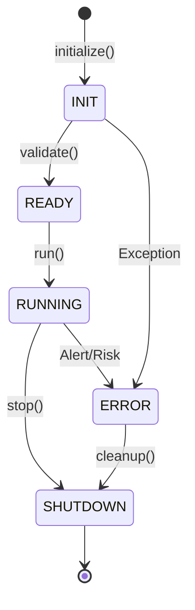

# Sovereign Unified Orchestrator Specification (PHASE_-1_5_G3)

The `TradingOrchestrator` is the single sovereign authority for the QTrader system, responsible for enforced initialization, architectural certification, and state-aware execution lifecycle management.

## 1. System State Machine

The orchestrator enforces a deterministic state machine to prevent race conditions and illegal execution during bootstrap.

### State Definitions:
- **INIT**: Bootstrap phase. Authorities (Config, Seed, Trace, FailFast) are being activated.
- **READY**: Architectural certification complete. System is compliant and awaiting execution signal.
- **RUNNING**: Autonomous loops and market data ingestion are active.
- **ERROR**: Critical breach detected (Risk/Latency/Sync). All execution is gated.
- **SHUTDOWN**: Resource cleanup and state persistence.

---

## 2. Initialization Priority (Mandatory)

The `initialize()` method follows a strict priority sequence. A failure at any step triggers a `HARD STOP`.

1.  **ConfigManager**: Load canonical precision and system parameters.
2.  **SeedManager**: Apply the global deterministic seed for all PRNGs.
3.  **TraceManager**: Activate context-aware tracing for all async boundaries.
4.  **FailFastEngine**: Perform pre-flight architectural checks.
5.  **Validation**: A final check ensures all previous stages returned `SUCCESS`.

---

## 3. Execution Gating

To ensure zero-jitter and deterministic behavior, the following entry points are strictly gated:

| Entry Point | Gate Condition | Action on Failure |
| :--- | :--- | :--- |
| `ingest_raw_data()` | `S == RUNNING` | Log WARNING; Drop Event |
| `handle_market_data()` | `S == RUNNING` | SILENT DROP |
| `run_autonomous()` | `S == READY` | Raise RuntimeError |
| `inject_event()` | N/A (Always) | Trace Injection |

---

## 4. Observability & Audit

- **system_boot_log.json**: Forensic record of startup timing and authority status.
- **MetricsCollector**: Real-time tracking of state transitions and loop latencies.
- **AlertEngine**: Unified hook for transitioning the system to `ERROR` state on breach.
