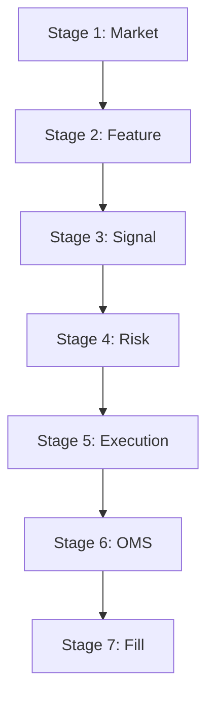

# Execution Pipeline Specification - QTrader Canonical Model

This document defines the sovereign execution pipeline for the QTrader system. All operations must follow this 7-stage sequence to ensure architectural integrity, risk containment, and auditability.

## 1. Canonical Sequence

The pipeline operates as a directed acyclic graph (DAG) of event-driven stages:

## 2. Stage Definitions

| Stage | Responsibility | Primary Component | Input Event | Output Event |
| :--- | :--- | :--- | :--- | :--- |
| **1. Market** | Ingestion & Alpha Generation | `handle_market_data` | `MARKET_DATA` | `FEATURES` |
| **2. Feature** | Validation & Normalization | `FeatureValidator` | `FEATURES` | `VALIDATED_FEATURES` |
| **3. Signal** | Multi-model Consensus | `EnsembleStrategy` | `VALIDATED_FEATURES` | `SIGNALS` |
| **4. Risk** | Pre-trade Risk & Allocation | `RuntimeRiskEngine` | `SIGNALS` | `ORDER` (if approved) |
| **5. Execution**| Routing & Matching | `ExecutionEngine` | `ORDER` | `EXCHANGE_REQUEST` |
| **6. OMS** | State Persistence | `UnifiedOMS` | `ORDER` / `ACK` | `OMS_STATE` |
| **7. Fill** | Reconciliation | `handle_fills` | `FILL` | `POSITION_UPDATE` |

## 3. Sovereign Constraints

1. **Sequential Integrity**: Stage $S_n$ must never be triggered unless $S_{n-1}$ has completed and published its validating event.
2. **Zero Bypass**: No module in Stage $n$ is permitted to directly call a method or publish an event intended for Stage $n+2$ or beyond.
3. **Traceability**: Every event in the pipeline must carry a `trace_id` generated at Stage 1 (Market) to enable cross-pipeline debugging.

## 4. Enforcement Mechanism

The [TradingOrchestrator](file:///Users/hoangnam/qtrader/qtrader/core/orchestrator.py) acts as the **Pipeline Supervisor**, enforcing these transitions through its internal async event handlers.
